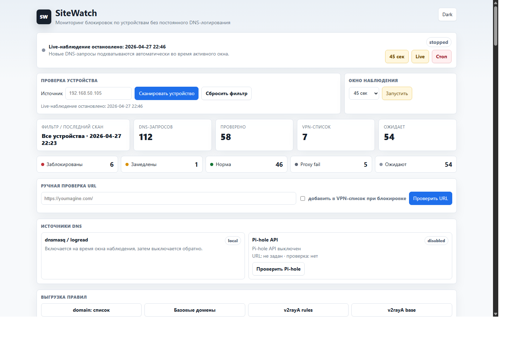
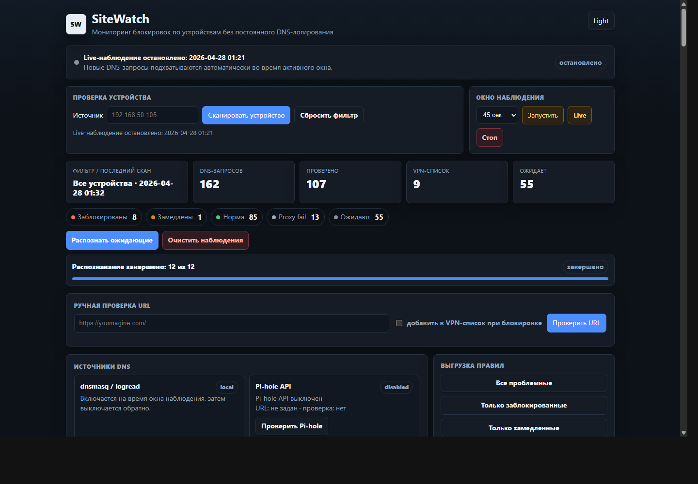

# SiteWatch for OpenWrt + v2rayA + Pi-hole

Легкий локальный сканер для OpenWrt:

- включает DNS query logging только на короткое окно наблюдения;
- берет домены и источник запроса из DNS-логов Pi-hole/dnsmasq;
- дозированно проверяет сайты напрямую и через SOCKS/HTTP proxy v2rayA;
- показывает простой UI через `uhttpd` CGI;
- фильтрует и сканирует домены конкретного устройства;
- выгружает готовый список `domain:example.com` для правил v2rayA/Xray.

SiteWatch помогает понять, какие домены у конкретных устройств не открываются напрямую или заметно замедляются, и быстро выгрузить эти домены в правила v2rayA/Xray. Он не держит DNS-логирование постоянно включенным: окно наблюдения запускается вручную, затем запросы собираются, проверяются и превращаются в список для VPN.





## Два режима работы

SiteWatch рассчитан на два аккуратных варианта установки:

1. **Контейнер отдельно от роутера.** Сервис работает на ПК, сервере или NAS и не управляет OpenWrt напрямую. Он читает примонтированные логи `dnsmasq`/Pi-hole из `/logs` или забирает запросы через удаленный Pi-hole API, а HTTP/proxy-проверки выполняет из контейнера.
2. **Нативно на OpenWrt.** Сервис работает на роутере, временно включает локальное DNS-логирование `dnsmasq` только на время окна наблюдения, читает локальные логи и при необходимости дополнительно забирает запросы из удаленного Pi-hole API.

За поведение локального `dnsmasq` отвечает `SITEWATCH_DNSMASQ_CONTROL`. Для OpenWrt по умолчанию `1`, для контейнера entrypoint выставляет `0`, чтобы контейнер никогда не пытался включать или перезапускать `dnsmasq`.

## Что ставить на роутер

Для shell-fallback и Pi-hole API нужны:

```sh
opkg update
opkg install curl ca-bundle
```

Если Go-бинарник не установлен, сканирование использует shell-fallback через `curl`. Тогда нужен полный вариант `curl`/`libcurl` с поддержкой proxy. Проверка:

```sh
curl --version
```

В выводе желательно увидеть поддержку `AsynchDNS`, `HTTPS-proxy` или `SOCKS`.

Если установлен бинарник `/usr/bin/sitewatch`, сканирование и ручная проверка URL работают без `curl`: HTTP/HTTPS, HTTP proxy и SOCKS5/SOCKS5H выполняются внутри Go-бинарника. Shell-скрипты остаются совместимым fallback.

Сборка для GL-MT6000 / `aarch64_cortex-a53`:

```sh
make build-openwrt-arm64
```

Релизная сборка для основных архитектур OpenWrt:

```sh
make build-openwrt-all
```

Без локального Go можно собрать тем же способом через Docker на этом ПК. По умолчанию собираются все релизные цели:

```powershell
powershell -NoProfile -ExecutionPolicy Bypass -File scripts\build-openwrt-docker.ps1
```

Можно собрать одну архитектуру:

```powershell
powershell -NoProfile -ExecutionPolicy Bypass -File scripts\build-openwrt-docker.ps1 -Arch arm64
```

В GitLab включен pipeline `.gitlab-ci.yml`: job `build-openwrt-release` собирает релизный набор и сохраняет `dist/` в artifacts на 30 дней.

Получится:

```text
dist/sitewatch-linux-arm64
dist/sitewatch-linux-armv7
dist/sitewatch-linux-armv6
dist/sitewatch-linux-amd64
dist/sitewatch-linux-386
dist/sitewatch-linux-mips
dist/sitewatch-linux-mipsle
dist/SHA256SUMS
```

Для OpenWrt `aarch64_cortex-a53` нужен `sitewatch-linux-arm64`; для `x86_64` нужен `sitewatch-linux-amd64`; для `i386_pentium4` чаще всего нужен `sitewatch-linux-386`; для `arm_cortex-a7_*` подойдет `sitewatch-linux-armv7`; для многих старых MIPS-роутеров используются `sitewatch-linux-mips` или `sitewatch-linux-mipsle`.

Установщик сам выберет подходящий `dist/sitewatch-linux-*` по `uname -m` и `/etc/openwrt_release` и положит его в `/usr/bin/sitewatch`. Если автоопределение не подошло, скопируй нужный бинарник вручную как `/usr/bin/sitewatch`.

## Docker / отдельный сервис

SiteWatch можно запустить отдельно от роутера в контейнере. В этом режиме приложение не включает `dnsmasq` на OpenWrt само: оно читает примонтированные DNS-логи из `/logs`, опционально забирает запросы через Pi-hole API и выполняет HTTP/proxy-проверки из контейнера.

Быстрый запуск:

```sh
docker compose up -d --build
```

Открыть:

```text
http://localhost:8095/
```

Данные и настройки живут в volume `sitewatch-data`, а локальные логи можно положить или примонтировать в `./logs`. Основные переменные в `docker-compose.yml`:

```yaml
SITEWATCH_PROXY: "http://host.docker.internal:20171"
SITEWATCH_DNSMASQ_CONTROL: "0"
SITEWATCH_LOG_FILES: "/logs/pihole.log /logs/dnsmasq.log /logs/messages"
SITEWATCH_PIHOLE_API_ENABLED: "1"
SITEWATCH_PIHOLE_URL: "http://192.168.1.2:8155"
SITEWATCH_PIHOLE_PASSWORD: "<password>"
```

Если v2rayA работает на роутере, укажи роутер вместо `host.docker.internal`, например `http://192.168.1.1:20171`. Если контейнер нужен только для ручной проверки и Pi-hole API, DNS-логи можно не монтировать. Если есть только логи без Pi-hole API, оставь `SITEWATCH_PIHOLE_API_ENABLED="0"` и примонтируй нужные файлы в `/logs`.

### Агент на OpenWrt для контейнера

Если SiteWatch работает в контейнере, а Pi-hole нет, лучше не читать лог-файлы с роутера по сети. Поставь на OpenWrt только маленький `sitewatch-agent`: он временно включает `dnsmasq logqueries`, читает `logread -f`, парсит DNS-запросы в потоке и отправляет в контейнер уже готовые пары `source/domain`.

Сначала сгенерируй общий токен на Unraid/Linux-хосте:

```sh
SITEWATCH_TOKEN="$(openssl rand -hex 32)"
echo "$SITEWATCH_TOKEN"
```

Если `openssl` недоступен:

```sh
SITEWATCH_TOKEN="$(head -c 32 /dev/urandom | base64 | tr -d '=+/[:space:]' | cut -c1-48)"
echo "$SITEWATCH_TOKEN"
```

Тот же токен нужно указать и в контейнере, и на роутере. Без токена ingest endpoint открыт внутри твоей сети, поэтому для постоянного запуска токен лучше включить.

Пример запуска контейнера:

```sh
docker run -d \
  --name sitewatch \
  --restart unless-stopped \
  -p 8095:8095 \
  -v /mnt/user/appdata/sitewatch:/data \
  -v /mnt/user/appdata/sitewatch/logs:/logs:ro \
  -e SITEWATCH_DNSMASQ_CONTROL=0 \
  -e SITEWATCH_PROXY=http://192.168.1.1:20171 \
  -e SITEWATCH_INGEST_TOKEN="$SITEWATCH_TOKEN" \
  aceasket/openwrt-sitewatch:dev
```

На роутере в `/etc/sitewatch/sitewatch.conf`:

```sh
SITEWATCH_RUN_MODE="agent"
SITEWATCH_AGENT_INGEST_URL="http://<container-host>:8095/cgi-bin/sitewatch"
SITEWATCH_INGEST_TOKEN="<same-token>"
```

То же самое можно задать в веб-интерфейсе роутера: вкладка **Настройки** -> режим **Агент в контейнер**, URL контейнера и общий токен. После этого обычная кнопка запуска окна наблюдения на роутере будет стартовать `sitewatch-agent`, а не локальный сборщик.

После настройки контейнера и роутера запуск короткого окна вручную:

```sh
sitewatch-agent 45
```

Live-режим без таймера:

```sh
sitewatch-agent 0
```

Остановка:

```sh
sitewatch-agent stop
```

Агент не пишет растущий DNS-лог на роутере: он держит только маленький статус в `/tmp/sitewatch-agent.status` и отправляет события в ingest endpoint контейнера.

Для Prometheus в контейнере и на OpenWrt доступен scrape endpoint:

```text
http://localhost:8095/cgi-bin/metrics
```

Он отдает счетчики наблюдений, результатов, очереди, VPN-списка, состояния capture/scan, Pi-hole API и читаемости настроенных DNS-логов.

## Установка

Скопировать папку `openwrt-sitewatch` на роутер, например в `/root/openwrt-sitewatch`, и выполнить:

```sh
cd /root/openwrt-sitewatch
chmod +x install-openwrt.sh
./install-openwrt.sh
```

Открыть:

```text
http://192.168.1.1:8095/
```

Установщик создает отдельный `uhttpd` instance `uhttpd.sitewatch` на порту `8095`, чтобы не смешивать SiteWatch с основной админкой OpenWrt/LuCI. CGI ставится в `/www/sitewatch/cgi-bin/sitewatch`, а корень порта открывает его как index.

Пример секции:

```sh
uhttpd.sitewatch.home='/www/sitewatch'
uhttpd.sitewatch.listen_http='0.0.0.0:8095'
uhttpd.sitewatch.cgi_prefix='/cgi-bin'
uhttpd.sitewatch.index_page='cgi-bin/sitewatch'
```

Если CGI выключен, проверь `/etc/config/uhttpd`: должна быть секция/параметры CGI для `/cgi-bin`.

## Удаление с роутера

Чтобы перенести SiteWatch в контейнер и убрать его с OpenWrt, сначала можно сохранить данные:

```sh
./uninstall-openwrt.sh --backup /root
```

По умолчанию скрипт удаляет `uhttpd.sitewatch`, CGI и бинарники из `/usr/bin`, но оставляет `/etc/sitewatch` с настройками, результатами и VPN-списком. Полное удаление данных:

```sh
./uninstall-openwrt.sh --backup /root --purge-data
```

## Настройка

Основной файл:

```sh
/etc/sitewatch/sitewatch.conf
```

Важные параметры:

```sh
SITEWATCH_PROXY="http://127.0.0.1:20171"
SITEWATCH_BATCH="12"
SITEWATCH_TIMEOUT="7"
SITEWATCH_SLOW_SECONDS="5"
SITEWATCH_SLOW_RATIO="3"
SITEWATCH_DNSMASQ_CONTROL="1"
SITEWATCH_PIHOLE_API_ENABLED="0"
SITEWATCH_PIHOLE_URL=""
SITEWATCH_PIHOLE_PASSWORD=""
SITEWATCH_PIHOLE_LOOKBACK="600"
SITEWATCH_PIHOLE_DISK="0"
SITEWATCH_EXCLUDE_DOMAINS="connectivitycheck.gstatic.com connectivitycheck.android.com"
SITEWATCH_CHECK_BASE_DOMAIN="1"
SITEWATCH_DPI_DNS_SERVER="1.1.1.1"
SITEWATCH_DPI_DOH_URL="https://cloudflare-dns.com/dns-query"
```

Если v2rayA слушает другой порт, поменяй `SITEWATCH_PROXY`.
`SITEWATCH_EXCLUDE_DOMAINS` не запрещает проверку домена в UI, но не дает служебным доменам автоматически попадать в VPN-выгрузку.
`SITEWATCH_CHECK_BASE_DOMAIN=1` включает дополнительную проверку базового домена: если `static2.mangapoisk.io` выглядит заблокированным, сканер отдельно проверит `mangapoisk.io`.
Ручная проверка URL также делает легкие DPI-пробы: сравнивает UDP DNS с DoH, проверяет TLS 1.3/TLS 1.2 напрямую к эталонному IP и делает HTTP probe на порт 80. `SITEWATCH_DPI_DNS_SERVER` и `SITEWATCH_DPI_DOH_URL` задают пару DNS-источников для сравнения.

Для Pi-hole на отдельном хосте можно включить API-сбор:

```sh
SITEWATCH_PIHOLE_API_ENABLED="1"
SITEWATCH_PIHOLE_URL="http://192.168.1.2:8155"
SITEWATCH_PIHOLE_PASSWORD="<PIHOLE_PASSWORD>"
SITEWATCH_PIHOLE_LOOKBACK="86400"
SITEWATCH_PIHOLE_DISK="0"
```

Пароль лучше хранить только на роутере в `/etc/sitewatch/sitewatch.conf`, не в git.
По умолчанию SiteWatch читает свежую live-выдачу Pi-hole API. Если нужна именно долговременная база Pi-hole, включи `SITEWATCH_PIHOLE_DISK="1"`, но новые запросы могут появляться там не сразу.
В статусе Pi-hole показывается количество реально импортированных DNS-пар `source/domain`, а не число сырых записей API. Запросы от `127.0.0.1` и `::1` игнорируются.

Примеры:

```sh
SITEWATCH_PROXY="http://127.0.0.1:20171"
SITEWATCH_PROXY="socks5h://127.0.0.1:20170"
```

## DNS-источник запроса

Сборщик ищет строки вида:

```text
query[A] youmagine.com from 192.168.1.50
```

По умолчанию читаются:

```sh
/var/log/pihole/pihole.log
/tmp/log/dnsmasq.log
/var/log/messages
```

Также используется `logread -e 'query['`, если включен `SITEWATCH_USE_LOGREAD=1`.

Если Pi-hole пишет лог в другое место, поменяй:

```sh
SITEWATCH_LOG_FILES="/path/to/pihole.log /tmp/log/dnsmasq.log"
```

## Ручной запуск

Снять короткое окно DNS-наблюдения:

```sh
sitewatch-capture 45
```

Скрипт временно включает `dhcp.@dnsmasq[0].logqueries`, собирает домены каждые несколько секунд и возвращает прежнюю настройку DNS-логирования после завершения.

Запуск без таймера:

```sh
sitewatch-capture 0
```

Остановка live-режима:

```sh
sitewatch-capture stop
```

Собрать домены из уже имеющихся логов и Pi-hole API:

```sh
sitewatch-collect
```

Проверить пачку доменов:

```sh
sitewatch-scan
```

Разово проверить конкретный URL напрямую и через v2rayA:

```sh
sitewatch-check-url https://youmagine.com/
```

Добавить домен в VPN-выгрузку, если проверка покажет `blocked` или `slow`:

```sh
sitewatch-check-url --add https://youmagine.com/
```

Проверить только одно устройство:

```sh
SITEWATCH_SOURCE_FILTER="192.168.1.50" SITEWATCH_FORCE_RESCAN=1 sitewatch-scan
```

Готовый список для v2rayA:

```sh
/etc/sitewatch/proxy-domains.txt
```

Формат:

```text
domain:youmagine.com
domain:myminifactory.com
```

## Фильтр по устройству

Открыть UI с конкретным источником:

```text
http://192.168.1.1:8095/?source=192.168.1.50
```

Запустить скан только для него:

```text
http://192.168.1.1:8095/?action=scan&source=192.168.1.50
```

## Cron

Для приватности и меньшего шума SiteWatch лучше держать в ручном режиме без cron: DNS-логирование включается только кнопкой `Снять DNS 45 сек`.

Если все же нужна автоматика, можно добавить:

```cron
*/10 * * * * /usr/bin/sitewatch-collect >/dev/null 2>&1
7 * * * * /usr/bin/sitewatch-scan >/dev/null 2>&1
```

Так роутер часто собирает DNS-кандидатов, но активно сканирует только одну маленькую пачку в час. В этом режиме DNS-логирование нужно держать включенным отдельно.

Для более слабого роутера:

```sh
SITEWATCH_BATCH="4"
SITEWATCH_TIMEOUT="5"
```

## Как понимать статусы

- `unchecked` - домен видели в DNS, но еще не проверяли.
- `ok` - напрямую открывается примерно нормально.
- `slow` - напрямую заметно медленнее, чем через v2rayA.
- `blocked` - напрямую таймаут/ошибка, через v2rayA открывается.
- `proxy_failed` - через v2rayA тоже не открылось, такой домен не надо автоматически добавлять в VPN-список.

## Как подключить к v2rayA

UI умеет скачать `proxy-domains.txt`, а файл на роутере лежит здесь:

```sh
/etc/sitewatch/proxy-domains.txt
```

Его можно использовать как источник для кастомного routing rule в v2rayA/Xray. Если v2rayA не умеет напрямую читать файл, список удобно открыть в UI и вставить в routing rule.

## Проверка на примере

Добавь домен в очередь вручную:

```sh
now="$(date +%s)"
printf "manual\tyoumagine.com\t%s\t%s\t1\n" "$now" "$now" >> /etc/sitewatch/seen.tsv
cp /etc/sitewatch/seen.tsv /etc/sitewatch/queue.tsv
sitewatch-scan
cat /etc/sitewatch/results.tsv
```

Если напрямую сайт не открывается, а через v2rayA открывается, появится:

```text
youmagine.com    manual    1    blocked    ...
```

И в `/etc/sitewatch/proxy-domains.txt` будет:

```text
domain:youmagine.com
```

Дополнительные выгрузки из UI:

```text
/?action=export
/?action=export_blocked
/?action=export_slow
/?action=export_base
/?action=export_v2raya
/?action=export_v2raya_blocked
/?action=export_v2raya_slow
/?action=export_v2raya_base
```

`export` отдаёт все проблемные домены (`blocked` + `slow`), `export_blocked` только заблокированные, `export_slow` только замедленные. `export_v2raya*` отдаёт строки для вставки в веб-интерфейс v2rayA:

```text
domain(domain: yummyani.me) -> proxy
domain(domain: shikimori.org) -> proxy
```

`export_base` и `export_v2raya_base` предварительно сворачивают поддомены до базового домена, например `static2.mangapoisk.io` -> `mangapoisk.io`.
